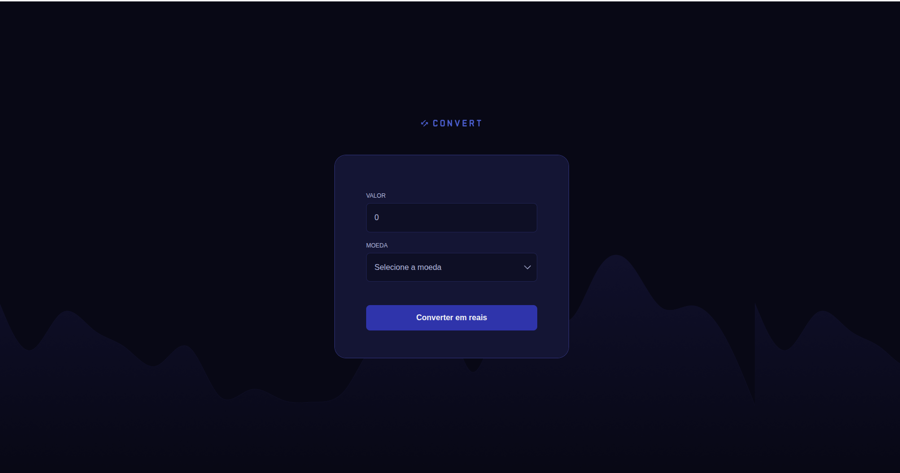

# 🔄 Convert

**Convert** é um projeto simples e funcional desenvolvido para realizar **conversões rápidas diretamente no navegador**, sem necessidade de instalação ou dependências externas.  
A proposta é oferecer uma interface intuitiva, leve e acessível para transformar dados de um formato para outro de forma prática.

## 📘 Sobre o Projeto

Este projeto surgiu com a ideia de criar um **conversor universal básico**, funcionando totalmente no lado do cliente (client-side).  
A aplicação utiliza HTML, CSS e JavaScript puro para processar os dados inseridos pelo usuário e convertê-los para outro formato previamente definido.

O objetivo é permitir que qualquer pessoa consiga:

- Converter rapidamente valores ou textos.
- Usar a ferramenta localmente sem enviar dados para servidores.
- Entender e modificar facilmente o código caso queira expandir o conversor.

## ✨ Funcionalidades

- Conversão instantânea no próprio navegador.
- Interface simples e responsiva.
- Totalmente offline — basta abrir o **index.html**.
- Código enxuto, fácil de ler e de modificar.
- Pode ser expandido para incluir novos tipos de conversão.

## 📁 Imagem do Projeto

